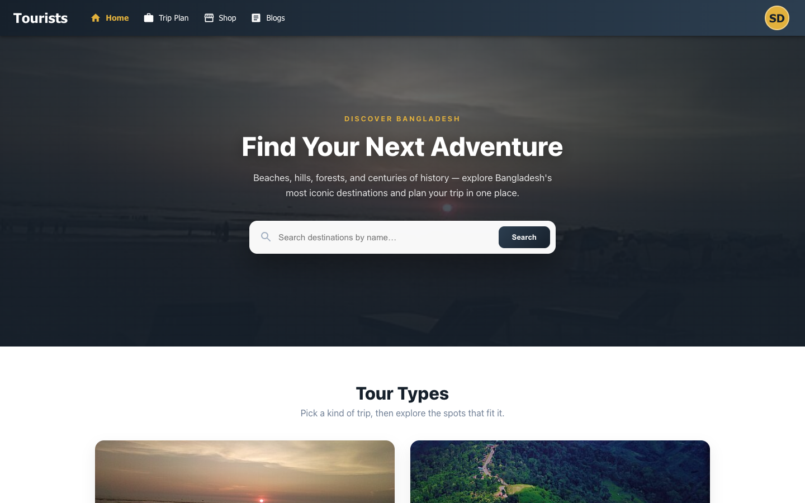
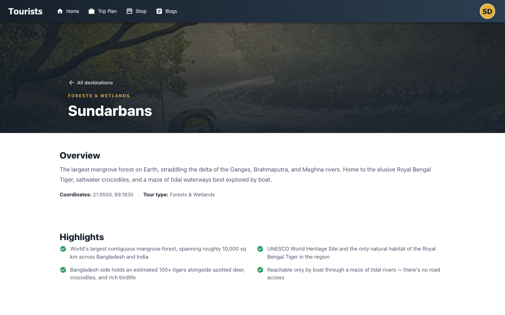
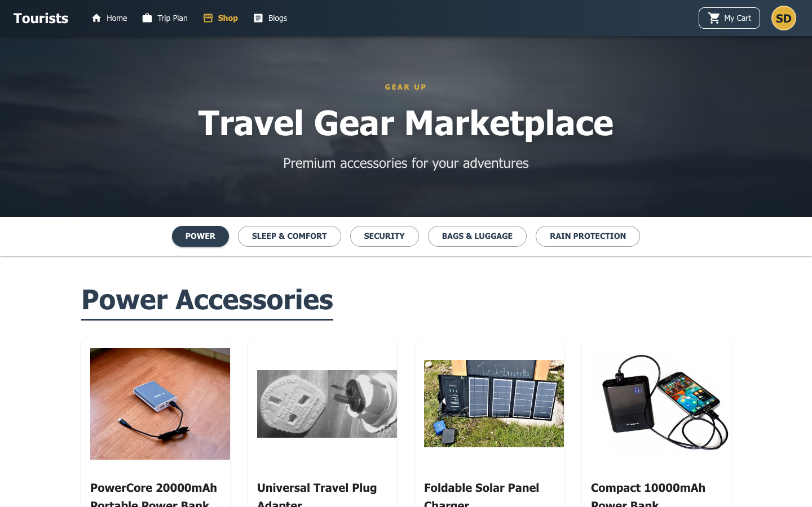
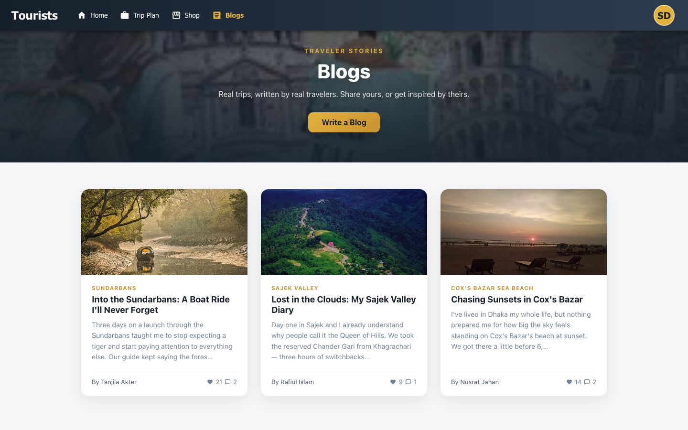
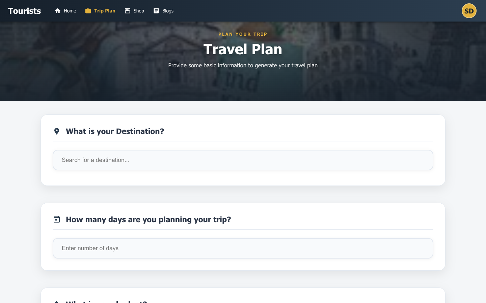
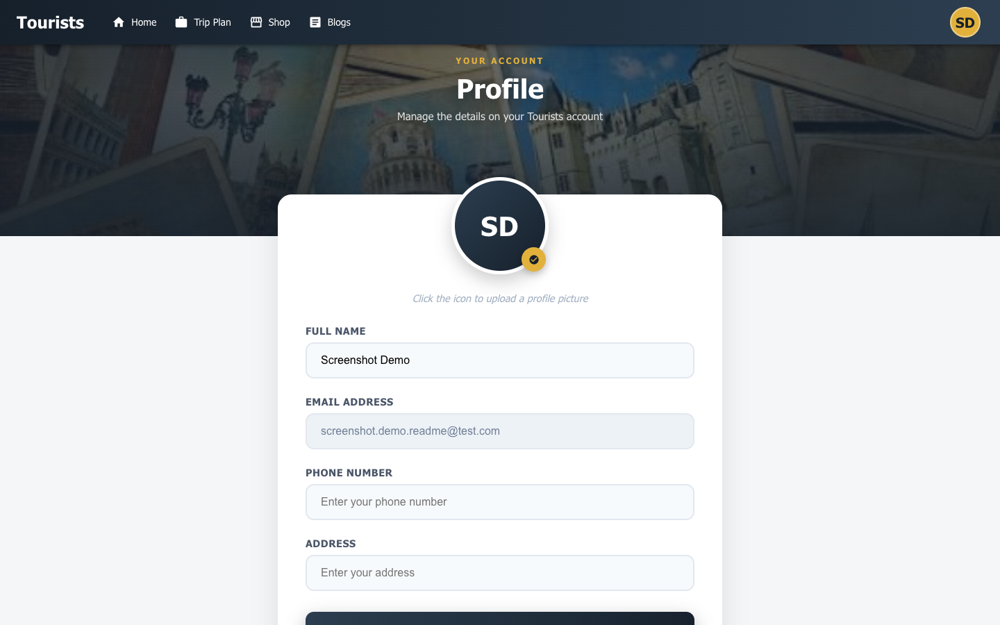
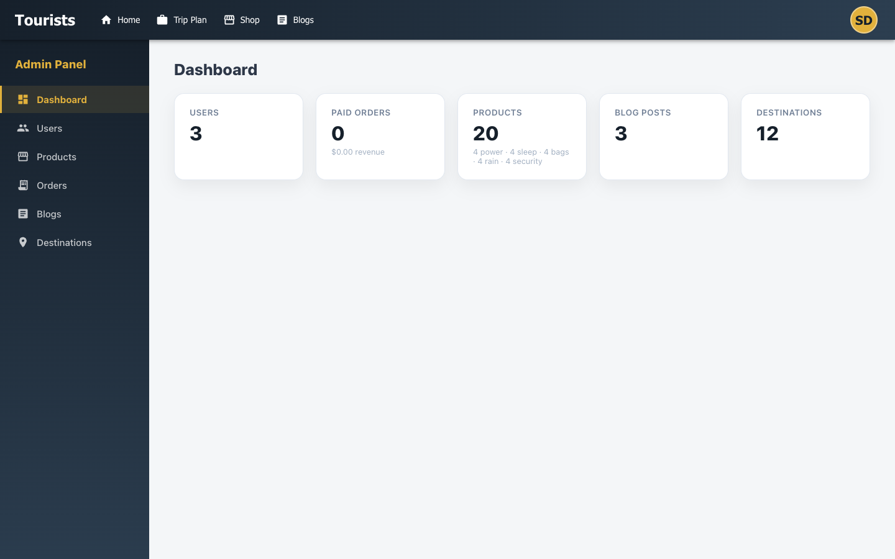
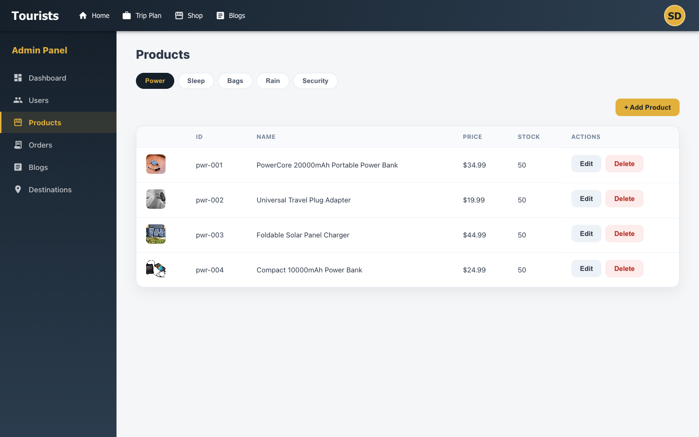

# 🌍 Tourism Platform

A full-stack MERN travel planning app: browse destinations on an interactive map, check nearby hotels/restaurants and a live weather forecast, generate a custom AI itinerary, and shop for travel gear — all behind JWT-secured accounts.

---

## ✨ Features

- **Authentication** — signup/login with bcrypt-hashed passwords, or "Continue with Google" (optional — only appears once configured). Sessions use a short-lived (15-minute) access JWT backed by a rotating, revocable refresh token — the client silently refreshes on a 401 and retries, so you never get logged out just because the access token expired. Accounts have a `customer`/`admin` role; admin-only endpoints gate a few write actions (delete any blog, list every order, update product stock).
- **Destination explorer** — browse tourist spots pulled from MongoDB (Redis cache-aside, 5-minute TTL), each pinned on an OpenStreetMap/Leaflet map (free, no API key required).
- **Destination detail pages** — a dedicated page per destination (`/destinations/:slug`) with an overview, highlights, nearby sub-attractions, ride/transport options, and local guide contacts (sample data, marked as placeholders).
- **Nearby places & directions** — find hotels/restaurants/resorts near a destination and get turn-by-turn directions from your current location, with automatic fallback suggestions (ferry, flight, land route) when no road route exists.
- **Weather forecast** — 5-hour and multi-day outlook plus travel-safety warnings for the selected destination, via OpenWeatherMap.
- **AI itinerary planner** — generates a day-by-day travel plan (hotels, sights, ticket pricing, best time to visit) from Google's Gemini model, saved to your account. Generation runs server-side as a queued BullMQ background job rather than blocking the request — `POST /planner/generate` returns instantly with a job id, and the client polls until it's done.
- **Travel gear shop** — browse products by category (power, sleep, security, bags, rain protection; each category list is Redis-cached, invalidated the instant stock changes), add to cart, and check out via SSLCommerz (sandbox). Categories are modeled as an adjacency-list tree (`bags` has 8 real subcategories — backpack, luggage, duffel bag, etc.); a DFS-based related-items endpoint climbs to a product's parent category and returns items from anywhere in that subtree. Checkout is backed by a real order pipeline: a pending `Order` is created at checkout, verified server-side against SSLCommerz's validation API (never trusting the browser redirect alone), settled exactly once even if the success redirect and IPN webhook both fire, and only then does it atomically decrement product stock and clear the cart. Order history is visible on the profile page.
- **Travel blogs** — read and write blog posts about real trips, with reactions and comments on each post. Reactions and comments push live over WebSockets to everyone else currently viewing that post — no refresh needed.
- **Profile management** — update name, phone, address, and profile photo.

---

## 🛠 Tech Stack

| Layer | Technology |
|---|---|
| Frontend | React 18, Vite, React Router, MUI |
| Backend | Node.js, Express |
| Database | MongoDB (Mongoose) |
| Caching | Redis (cache-aside, optional — degrades to direct DB reads if unreachable) |
| Background jobs | BullMQ + Redis (AI trip generation runs as a worker job, not inline on the request) |
| Auth | JWT (access/refresh rotation) + bcrypt, Google OAuth 2.0 |
| Real-time | Socket.io (live blog reactions/comments) |
| Maps | Leaflet + OpenStreetMap tiles (display), OSRM (driving directions), Overpass API (nearby places), Nominatim (destination search) — all free, no API key |
| Weather | OpenWeatherMap API |
| AI | Google Gemini API (server-side, queued) |
| Payments | SSLCommerz (sandbox) |
| Security | Helmet, express-rate-limit |
| API docs | Swagger UI (OpenAPI 3.0) at `/api/docs` |
| Tooling | ESLint, Prettier, Docker Compose, GitHub Actions CI |

---

## 🏗 Architecture

The backend follows a layered structure — routes parse nothing, controllers validate and shape responses, services hold the business logic and external API calls:

```
server/src/
  config/       env.js validates required env vars at startup; db.js connects to MongoDB
  models/       Mongoose schemas (User, TouristSpot, TripPlan, Order, cart/product models)
  services/     business logic + all external API calls (auth, maps, weather-adjacent, shop, cart, order, payment)
  controllers/  thin: parse the request, call a service, shape the { success, message, data } response
  routes/       one router per feature, mounted under /api/v1
  middleware/   JWT auth guard, centralized error handler, multer upload config
  utils/        ApiError, asyncHandler
  app.js        Express app: middleware, routes, error handler
  server.js     entry point: connects DB, starts listening
```

The frontend mirrors it with a feature-based structure:

```
client/src/
  api/          one axios instance (JWT auto-attached) + one module per backend feature
  components/   shared UI used across features (Navbar, ProtectedRoute)
  context/      AuthContext — holds the signed-in user's id/token
  hooks/        useAuth (+ feature-local hooks like useDirections, useCategoryProducts)
  features/     one folder per domain: auth, destinations, planner, weather, shop, cart, blogs, orders, profile
  App.jsx       routes, wrapped in AuthProvider
```

---

## 📡 API Reference

Base URL: `/api/v1`. All routes except `auth/*` and the payment gateway callbacks require `Authorization: Bearer <token>`. Interactive Swagger docs (with a "Try it out" console) are served at `/api/docs` while the server is running.

| Method | Path | Auth | Body | Response `data` |
|---|---|---|---|---|
| POST | `/auth/signup` | – | `{ name, email, password }` | `{ user, accessToken, refreshToken }` |
| POST | `/auth/login` | – | `{ email, password, rememberMe? }` | `{ user, accessToken, refreshToken }` — access token expires in 15 min; refresh token lasts 30 days if remembered, else 1 day |
| POST | `/auth/google` | – | `{ idToken, rememberMe? }` | `{ user, accessToken, refreshToken }` — verifies the Google ID token server-side; creates the account on first sign-in |
| POST | `/auth/refresh` | – | `{ refreshToken }` | `{ accessToken, refreshToken }` — rotates the refresh token; the old one stops working immediately |
| POST | `/auth/logout` | – | `{ refreshToken }` | – (revokes that refresh token) |
| GET | `/users/:userId` | JWT | – | user object |
| PUT | `/users/:userId` | JWT | `multipart/form-data`: `name, phonenum, address, image?` | updated user |
| GET | `/destinations` | JWT | – | tourist spot array |
| GET | `/destinations/:slug` | JWT | – | full spot detail (highlights, attractions, ride options, guide info) |
| GET | `/maps/places` | JWT | query: `location, radius, type` | Overpass (OpenStreetMap) nearby-place result |
| POST | `/planner` | JWT | trip plan object (`location, userId, duration, travelers, budget, hotels[], itinerary[]`) | saved plan |
| POST | `/planner/generate` | JWT | `{ location, totalDays, traveler, budget }` (rate-limited) | `{ jobId }` — queues the Gemini call as a background job, returns immediately |
| GET | `/planner/jobs/:jobId` | JWT | – | `{ status: queued\|processing\|completed\|failed, result, error }` — poll until `status` settles |
| GET | `/planner/:userId` | JWT | – | plan array |
| DELETE | `/planner/:id` | JWT | – | – |
| GET | `/shop/:category` | JWT | category = `power \| sleep \| bags \| rain \| security` | product array (each with a `stock` count) |
| PATCH | `/shop/:productId/stock` | JWT (admin) | `{ stock }` | updated product |
| GET | `/shop/categories` | JWT | – | nested category tree, e.g. `bags` with its 8 subcategories |
| GET | `/shop/products/:productId/related` | JWT | – | up to 6 related products (DFS across the category subtree) |
| POST | `/cart/add` | JWT | `{ userId, product }` | cart |
| GET | `/cart/:userId` | JWT | – | `{ products, totalItems, totalPrice }` |
| PUT | `/cart/update` | JWT | `{ userId, productId, quantity }` | cart |
| DELETE | `/cart/remove` | JWT | `{ userId, productId }` | cart |
| DELETE | `/cart/clear/:userId` | JWT | – | – |
| POST | `/payment/init` | JWT | `{ totalAmount, userId, cartItems }` | `{ url }` — SSLCommerz gateway URL; also creates a `pending` Order |
| POST | `/payment/success`, `/fail`, `/cancel`, `/ipn` | – (gateway callback) | – | verifies the transaction with SSLCommerz and settles the matching Order (idempotent); `success`/`fail`/`cancel` redirect the browser, `ipn` is the server-to-server webhook and just returns 200 |
| GET | `/orders` | JWT (admin) | – | every order across every user, newest first |
| GET | `/orders/:userId` | JWT | – | order array, newest first |
| GET | `/blogs` | JWT | – | blog array, newest first |
| GET | `/blogs/:id` | JWT | – | blog with comments |
| POST | `/blogs` | JWT | `{ title, place, content, imageUrl? }` | created blog |
| POST | `/blogs/:id/react` | JWT | – | blog with reaction toggled for the current user |
| POST | `/blogs/:id/comments` | JWT | `{ text }` | blog with the new comment appended |
| DELETE | `/blogs/:id` | JWT (author or admin) | – | – |

Every response follows `{ success: boolean, message: string, data: object|array|null }`; errors use the same shape with `success: false` and the relevant HTTP status code.

---

## 💡 Getting Started

### Prerequisites

- Node.js (LTS) and npm
- A MongoDB connection (e.g. a free [MongoDB Atlas](https://www.mongodb.com/cloud/atlas) cluster)
- Redis — `brew install redis && brew services start redis` locally, or point `REDIS_URL` at a hosted instance. Caching skips itself gracefully without it, but the AI trip-plan queue genuinely needs it (that's the point of a queue).
- API keys: [OpenWeatherMap](https://openweathermap.org/api) (client), [Google Gemini](https://ai.google.dev/) (server — `GEMINI_API_KEY` in `server/.env`, generation runs there now, not in the browser) — no Maps API key needed; the map, nearby-places search, directions, and destination autocomplete all run on free OpenStreetMap-based services (Leaflet, Overpass, OSRM, Nominatim) with no signup or billing required.

> **A note on the free map stack:** OSRM's and Overpass's public demo servers are rate-limited and meant for light/demo usage, not production traffic. Directions and nearby-place search may occasionally return a temporary error under heavy use — this is expected for the free tier, not a bug. For a production deployment, consider self-hosting OSRM/Overpass or using a paid provider.

> **Google sign-in is optional.** To enable it: in [Google Cloud Console](https://console.cloud.google.com/apis/credentials), create an OAuth 2.0 Client ID (type "Web application"), add `http://localhost:5173` under "Authorized JavaScript origins", then put that same Client ID in both `server/.env`'s `GOOGLE_CLIENT_ID` and `client/.env`'s `VITE_GOOGLE_CLIENT_ID`. Without it, the "Continue with Google" button simply doesn't render — everything else works normally.

### Setup

1. **Clone and install dependencies**
   ```
   git clone <repo-url>
   cd SystemProject-main
   npm install --prefix server
   npm install --prefix client
   ```

2. **Configure environment variables** — copy each example file and fill in real values:
   ```
   cp server/.env.example server/.env
   cp client/.env.example client/.env
   ```
   See `server/.env.example` and `client/.env.example` for the full list of required variables (Mongo URI, JWT secret, API keys, backend URL). The server validates all required variables at startup and fails fast with a clear message if any are missing.

3. **Seed the destination, shop, and blog catalogs** (optional, but the Home, Shop, and Blogs pages are empty without it):
   ```
   npm run seed --prefix server
   ```
   Populates 12 curated Bangladeshi destinations (Cox's Bazar, Sundarbans, Sajek Valley, and more) with real photos, descriptions, and coordinates, 4+ real products in every shop category (power, sleep, bags, rain, security), the shop category tree, and 3 demo blog posts with comments. Safe to re-run — every seed upserts instead of creating duplicates, and re-running never overwrites real comments/reactions a logged-in user has added to the demo blogs. Run them independently with `npm run seed:spots --prefix server` / `npm run seed:shop --prefix server` / `npm run seed:blogs --prefix server` / `npm run seed:categories --prefix server`. See `server/src/seed/touristSpots.data.js`, `server/src/seed/shopProducts.data.js`, `server/src/seed/blogs.data.js`, and `server/src/seed/categories.data.js` to edit or extend any list.

   Every account signs up as a plain `customer` — there's deliberately no self-service way to become an `admin`. Bootstrap the first admin (needed for the delete-any-blog, all-orders, and stock-update endpoints) after signing up normally:
   ```
   npm run promote:admin --prefix server -- you@example.com
   ```

4. **Run the backend**
   ```
   npm run dev --prefix server
   ```
   Starts on `http://localhost:3001` by default (configurable via `PORT`).

5. **Run the frontend**
   ```
   npm run dev --prefix client
   ```
   Starts on `http://localhost:5173` and talks to the backend via `VITE_BACKEND_URL`.

6. **Lint / format** (either package):
   ```
   npm run lint --prefix server
   npm run format --prefix server
   ```

### Running with Docker

An alternative to the manual setup above — `docker-compose.yml` wires up Mongo, Redis, the server, and the client together.

```
cp .env.example .env   # fill in JWT_SECRET, SSLCOMMERZ creds, weather/Gemini keys
docker compose up --build
```

The client is served at `http://localhost:8080`, the API at `http://localhost:3001` (docs at `/api/docs`). Vite bakes its `VITE_*` env vars in at build time, so changing them requires `docker compose up --build` again, not just a restart.

> These Dockerfiles/compose file follow standard patterns for a Node + Mongo + Vite/nginx app but haven't been verified against a real Docker install in this environment — if something doesn't build cleanly, it's worth a second look before relying on it in production.

---

## ☁️ Deployment

See [DEPLOYMENT.md](./DEPLOYMENT.md) for a step-by-step guide to deploying this app for
free — Vercel (frontend), Render (backend), MongoDB Atlas, Upstash (Redis), and Cloudinary
(avatar uploads), including a `render.yaml` Blueprint for one-click backend setup.

---

## 📸 Screenshots

**Home** — search, tour types, and featured destinations


**Destination detail** — overview, highlights, and trip-planning context per spot


**Shop** — the travel gear marketplace, category-tabbed


**Blogs** — traveler stories with live reactions/comments


**Trip Plan** — the AI itinerary generator


**Profile** — account details, avatar upload, order history, saved trips


**Admin Dashboard** — live site-wide stats for admins


**Admin Products** — category-tabbed CRUD across the shop catalog



