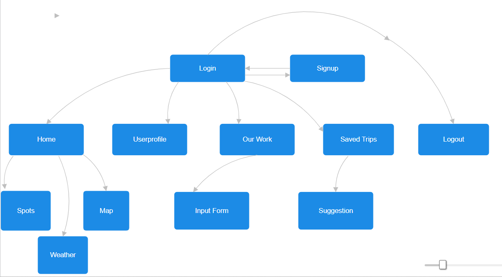
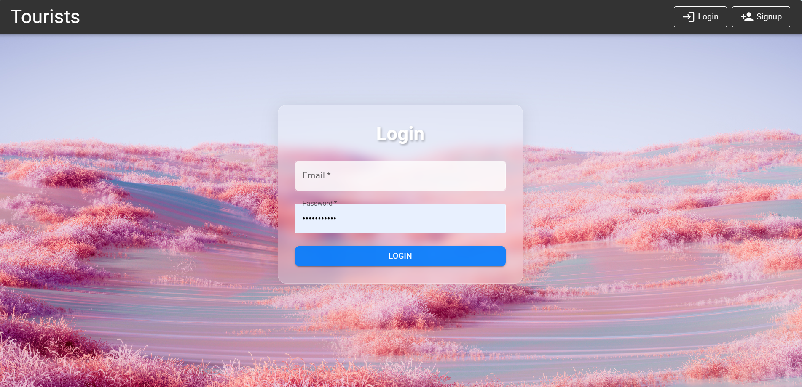
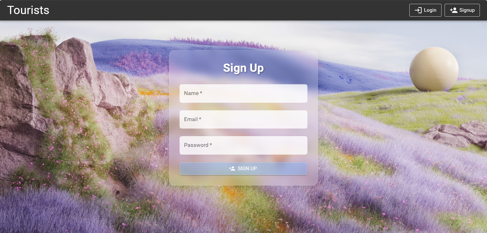
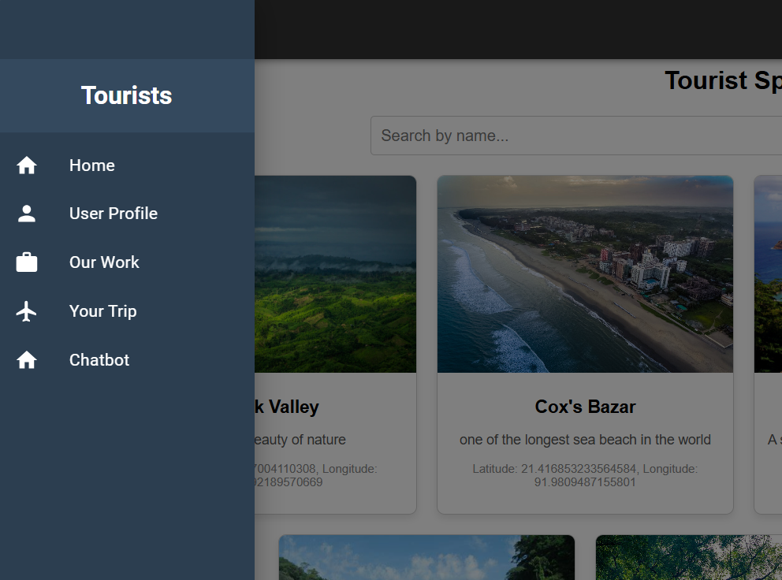
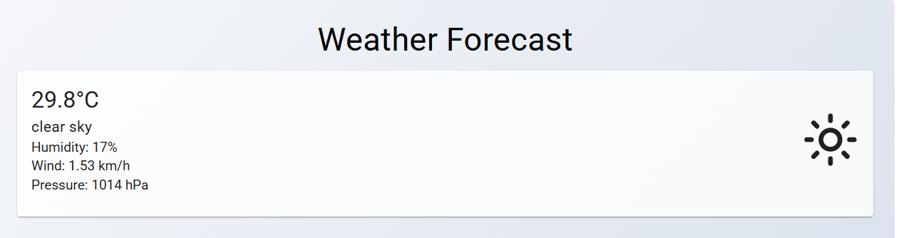
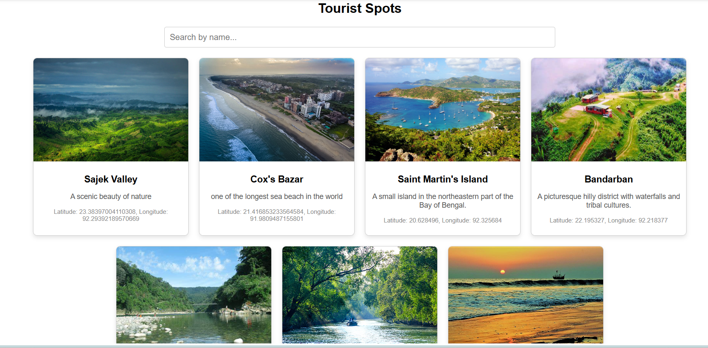
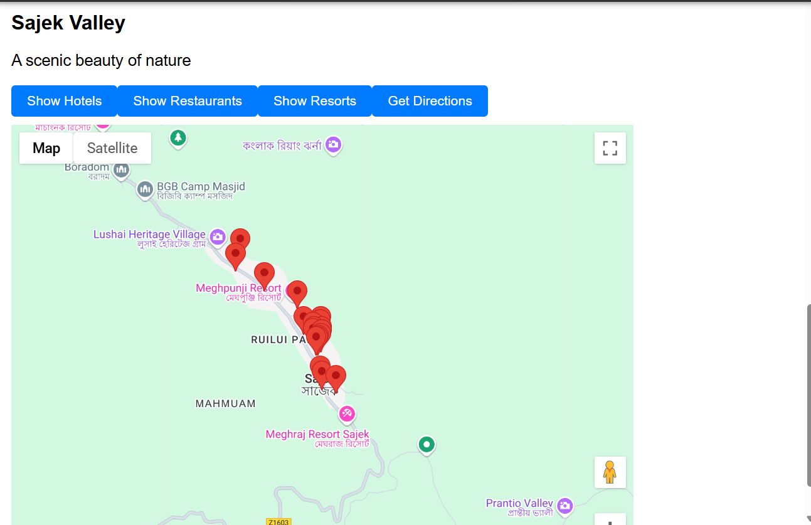
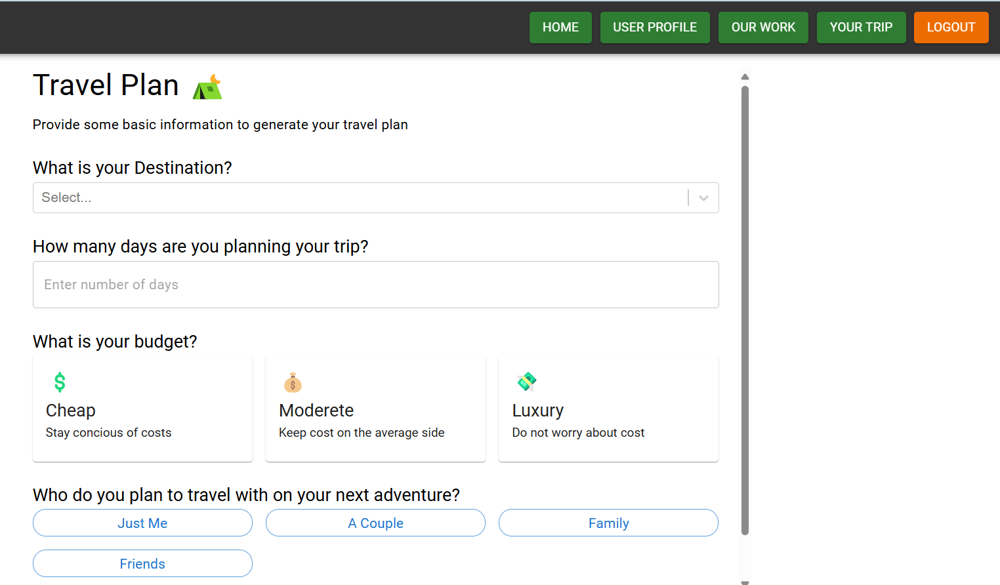
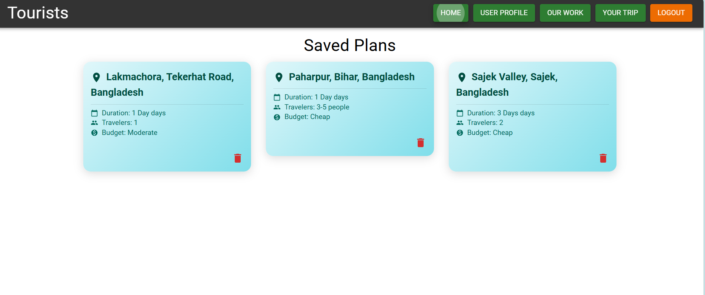
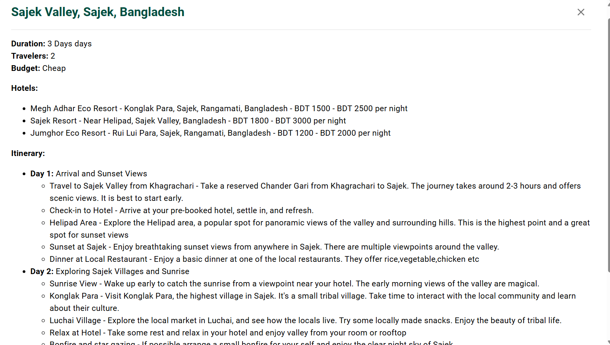

# 🌍 Tourism Platform

A full-stack MERN travel planning app: browse destinations on an interactive map, check nearby hotels/restaurants and a live weather forecast, generate a custom AI itinerary, and shop for travel gear — all behind JWT-secured accounts.

---

## ✨ Features

- **Authentication** — signup/login with bcrypt-hashed passwords and JWT session tokens.
- **Destination explorer** — browse tourist spots pulled from MongoDB, each pinned on an OpenStreetMap/Leaflet map (free, no API key required).
- **Destination detail pages** — a dedicated page per destination (`/destinations/:slug`) with an overview, highlights, nearby sub-attractions, ride/transport options, and local guide contacts (sample data, marked as placeholders).
- **Nearby places & directions** — find hotels/restaurants/resorts near a destination and get turn-by-turn directions from your current location, with automatic fallback suggestions (ferry, flight, land route) when no road route exists.
- **Weather forecast** — 5-hour and multi-day outlook plus travel-safety warnings for the selected destination, via OpenWeatherMap.
- **AI itinerary planner** — generates a day-by-day travel plan (hotels, sights, ticket pricing, best time to visit) from Google's Gemini model, saved to your account.
- **Travel gear shop** — browse products by category (power, sleep, security, bags, rain protection), add to cart, and check out via SSLCommerz (sandbox). Checkout is backed by a real order pipeline: a pending `Order` is created at checkout, verified server-side against SSLCommerz's validation API (never trusting the browser redirect alone), settled exactly once even if the success redirect and IPN webhook both fire, and only then does it atomically decrement product stock and clear the cart. Order history is visible on the profile page.
- **Travel blogs** — read and write blog posts about real trips, with reactions and comments on each post.
- **Profile management** — update name, phone, address, and profile photo.

---

## 🛠 Tech Stack

| Layer | Technology |
|---|---|
| Frontend | React 18, Vite, React Router, MUI |
| Backend | Node.js, Express |
| Database | MongoDB (Mongoose) |
| Auth | JWT + bcrypt |
| Maps | Leaflet + OpenStreetMap tiles (display), OSRM (driving directions), Overpass API (nearby places), Nominatim (destination search) — all free, no API key |
| Weather | OpenWeatherMap API |
| AI | Google Gemini API |
| Payments | SSLCommerz (sandbox) |
| Tooling | ESLint, Prettier |

---

## 🏗 Architecture

The backend follows a layered structure — routes parse nothing, controllers validate and shape responses, services hold the business logic and external API calls:

```
server/src/
  config/       env.js validates required env vars at startup; db.js connects to MongoDB
  models/       Mongoose schemas (User, TouristSpot, TripPlan, Order, cart/product models)
  services/     business logic + all external API calls (auth, maps, weather-adjacent, shop, cart, order, payment)
  controllers/  thin: parse the request, call a service, shape the { success, message, data } response
  routes/       one router per feature, mounted under /api/v1
  middleware/   JWT auth guard, centralized error handler, multer upload config
  utils/        ApiError, asyncHandler
  app.js        Express app: middleware, routes, error handler
  server.js     entry point: connects DB, starts listening
```

The frontend mirrors it with a feature-based structure:

```
client/src/
  api/          one axios instance (JWT auto-attached) + one module per backend feature
  components/   shared UI used across features (Navbar, ProtectedRoute)
  context/      AuthContext — holds the signed-in user's id/token
  hooks/        useAuth (+ feature-local hooks like useDirections, useCategoryProducts)
  features/     one folder per domain: auth, destinations, planner, weather, shop, cart, blogs, orders, profile
  App.jsx       routes, wrapped in AuthProvider
```

---

## 📡 API Reference

Base URL: `/api/v1`. All routes except `auth/*` and the payment gateway callbacks require `Authorization: Bearer <token>`.

| Method | Path | Auth | Body | Response `data` |
|---|---|---|---|---|
| POST | `/auth/signup` | – | `{ name, email, password }` | `{ user, token }` |
| POST | `/auth/login` | – | `{ email, password }` | `{ user, token }` |
| GET | `/users/:userId` | JWT | – | user object |
| PUT | `/users/:userId` | JWT | `multipart/form-data`: `name, phonenum, address, image?` | updated user |
| GET | `/destinations` | JWT | – | tourist spot array |
| GET | `/destinations/:slug` | JWT | – | full spot detail (highlights, attractions, ride options, guide info) |
| GET | `/maps/places` | JWT | query: `location, radius, type` | Overpass (OpenStreetMap) nearby-place result |
| POST | `/planner` | JWT | trip plan object (`location, userId, duration, travelers, budget, hotels[], itinerary[]`) | saved plan |
| GET | `/planner/:userId` | JWT | – | plan array |
| DELETE | `/planner/:id` | JWT | – | – |
| GET | `/shop/:category` | JWT | category = `power \| sleep \| bags \| rain \| security` | product array (each with a `stock` count) |
| POST | `/cart/add` | JWT | `{ userId, product }` | cart |
| GET | `/cart/:userId` | JWT | – | `{ products, totalItems, totalPrice }` |
| PUT | `/cart/update` | JWT | `{ userId, productId, quantity }` | cart |
| DELETE | `/cart/remove` | JWT | `{ userId, productId }` | cart |
| DELETE | `/cart/clear/:userId` | JWT | – | – |
| POST | `/payment/init` | JWT | `{ totalAmount, userId, cartItems }` | `{ url }` — SSLCommerz gateway URL; also creates a `pending` Order |
| POST | `/payment/success`, `/fail`, `/cancel`, `/ipn` | – (gateway callback) | – | verifies the transaction with SSLCommerz and settles the matching Order (idempotent); `success`/`fail`/`cancel` redirect the browser, `ipn` is the server-to-server webhook and just returns 200 |
| GET | `/orders/:userId` | JWT | – | order array, newest first |
| GET | `/blogs` | JWT | – | blog array, newest first |
| GET | `/blogs/:id` | JWT | – | blog with comments |
| POST | `/blogs` | JWT | `{ title, place, content, imageUrl? }` | created blog |
| POST | `/blogs/:id/react` | JWT | – | blog with reaction toggled for the current user |
| POST | `/blogs/:id/comments` | JWT | `{ text }` | blog with the new comment appended |
| DELETE | `/blogs/:id` | JWT | – | – (only the blog's own author can delete it) |

Every response follows `{ success: boolean, message: string, data: object|array|null }`; errors use the same shape with `success: false` and the relevant HTTP status code.

---

## 💡 Getting Started

### Prerequisites

- Node.js (LTS) and npm
- A MongoDB connection (e.g. a free [MongoDB Atlas](https://www.mongodb.com/cloud/atlas) cluster)
- API keys: [OpenWeatherMap](https://openweathermap.org/api), [Google Gemini](https://ai.google.dev/) — no Maps API key needed; the map, nearby-places search, directions, and destination autocomplete all run on free OpenStreetMap-based services (Leaflet, Overpass, OSRM, Nominatim) with no signup or billing required.

> **A note on the free map stack:** OSRM's and Overpass's public demo servers are rate-limited and meant for light/demo usage, not production traffic. Directions and nearby-place search may occasionally return a temporary error under heavy use — this is expected for the free tier, not a bug. For a production deployment, consider self-hosting OSRM/Overpass or using a paid provider.

### Setup

1. **Clone and install dependencies**
   ```
   git clone <repo-url>
   cd SystemProject-main
   npm install --prefix server
   npm install --prefix client
   ```

2. **Configure environment variables** — copy each example file and fill in real values:
   ```
   cp server/.env.example server/.env
   cp client/.env.example client/.env
   ```
   See `server/.env.example` and `client/.env.example` for the full list of required variables (Mongo URI, JWT secret, API keys, backend URL). The server validates all required variables at startup and fails fast with a clear message if any are missing.

3. **Seed the destination, shop, and blog catalogs** (optional, but the Home, Shop, and Blogs pages are empty without it):
   ```
   npm run seed --prefix server
   ```
   Populates 12 curated Bangladeshi destinations (Cox's Bazar, Sundarbans, Sajek Valley, and more) with real photos, descriptions, and coordinates, 4+ real products in every shop category (power, sleep, bags, rain, security), and 3 demo blog posts with comments. Safe to re-run — every seed upserts instead of creating duplicates, and re-running never overwrites real comments/reactions a logged-in user has added to the demo blogs. Run them independently with `npm run seed:spots --prefix server` / `npm run seed:shop --prefix server` / `npm run seed:blogs --prefix server`. See `server/src/seed/touristSpots.data.js`, `server/src/seed/shopProducts.data.js`, and `server/src/seed/blogs.data.js` to edit or extend any list.

4. **Run the backend**
   ```
   npm run dev --prefix server
   ```
   Starts on `http://localhost:3001` by default (configurable via `PORT`).

5. **Run the frontend**
   ```
   npm run dev --prefix client
   ```
   Starts on `http://localhost:5173` and talks to the backend via `VITE_BACKEND_URL`.

6. **Lint / format** (either package):
   ```
   npm run lint --prefix server
   npm run format --prefix server
   ```

---

## 📸 Screenshots




















